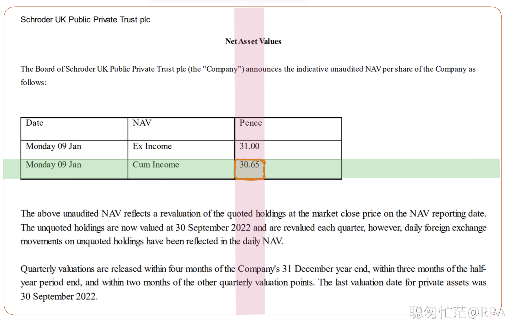

# EasyDoc

This tool is designed to perform simple information extraction from pdf/images based on provided keywords.

Key features:
- [PDFPlumber](https://github.com/jsvine/pdfplumber) for digital documents 
- OCR for scanned documents
  - [PaddleOCR](https://github.com/PaddlePaddle/PaddleOCR) as default OCR engine
  - [Easy OCR](https://github.com/JaidedAI/EasyOCR) for multilingual support
  - [TrOCR model](https://huggingface.co/microsoft/trocr-large-handwritten) for handwriting recognition
- [Cosine similarity](https://www.sbert.net/docs/pretrained_models.html#semantic-search) to locate the most similar keyword
  - Fuzziness is 65% by default, and adjustable
- Locate information by defining a `relative position` to the given element
  - above, below, left, right
  - on the same row, on the same column
- Perform NER analysis for given texts ([spacy](https://spacy.io/))
- Merge long sentences on the same line into 1 bbox

Road ahead:
- Table detection
- Table structure analysis

Example code:
```Python
from EasyDoc import EasyDoc
doc = EasyDoc(r"Test.pdf")

ocr_result = doc.extract_words()
doc.on_the_same_column(text='Name (as shown', relation='below')
doc.set_region(text='Business name', relation='above')
Name = doc.extract_text(engine='TrOCR-handwritten') #Bruce Wayne
doc.draw_region('Name', show_image=True)
```


Example code:
```Python
from EasyDoc import EasyDoc
doc = EasyDoc(r"doc/Test.pdf")
ocr_result = doc.extract_words(apply_ocr=False)
doc.on_the_same_row(text='Cum Income')
doc.on_the_same_column(text='Pence')
NAV = doc.extract_text() #30.65
```




# Installation
Prepare env: Python 3.9, PyTorch 1.12.1, CUDA 11.6, Cudnn 8.4

```commandline
pip install pandas sentence-transformers pypdfium2 easyocr pdfplumber Pillow 'spacy[cuda-autodetect]'

pip install paddlepaddle-gpu==2.4.1.post116 -f https://www.paddlepaddle.org.cn/whl/windows/mkl/avx/stable.html

pip uninstall opencv-python opencv-python-headless

pip install "paddleocr>=2.0.1"

python -m spacy download en_core_web_trf
```

# Usage
## Initialization
```Python
doc = EasyDoc(r"Test.pdf")
ocr_result = doc.extract_words()
```
| Paremeters   | Default value |
|--------------|---------------|
| apply_OCR    | True          |
| lang         | en, ch, cht   |
| page         | 1             |
| temp_folder  | tmp           |
| tmp_prefix   | image         |

## find_text
```Python
element = doc.find_text(keyword='Name').iloc[0][:]
```

| Paremeters | Values                          | Default                   |
|------------|---------------------------------|---------------------------|
| keyword    |                                 |                           |
| fuzzy      | 0-1                             | 0.65                      |
| position   | None, top, bottom, left, right  | None                      |
| nth        | 0: return all; >=1, return nth  | 1                         | 
| sort_by    | any columns in self.ocr_result  | fuzzy_matching_lower_trim |


## set_region
```Python
element = doc.find_text(keyword='Name',fuzzy=0.65, position='top').iloc[0][:]
doc.set_region(element, relation='above', offset=-30)
#or directly search by text
doc.set_region(text='Employer Identification number', relation='above', offset=-30)
```
Fuzziness is calculated using cosine similarity, based on model `multi-qa-mpnet-base-cos-v1`.

| relation | position | default | Note                                          |
|----------|----------|---------|-----------------------------------------------|
| above    | whole    | Yes     | Above the entire element                      |
| above    | bottom   |         | Above the bottom of the element               |
| below    | whole    | Yes     | Below the entire element                      |
| below    | top      |         | Below the top of the element                  |
| left     | whole    | Yes     | On the left of the entire element             |
| left     | right    |         | On the left of the right-edge of the element  |              
| right    | whole    | Yes     | On the right of the entire element            |
| right    | left     |         | On the right of the left-edge of the element  |


## reset_region
We should reset the region when working on a new extraction area
```Python
doc.reset_region()
```

## on_the_same_row
Search by element
```Python
element = doc.find_text(keyword='Name (as shown',fuzzy=0.65, position='top').iloc[0][:]
doc.on_the_same_column(element, relation='below')
```
Search by text
```
doc.on_the_same_column(text='Name (as shown', relation='below')
```

Optional: 
- offset = (a,b)
- relation = 'above' or 'below'


## on_the_same_column
Search by element
```Python
element = doc.find_text(keyword='Social security number',fuzzy=0.65, position='top').iloc[0][:]
doc.on_the_same_column(element, relation='below', offset=(0, 420))
```
Search by text
```
doc.on_the_same_column(text='Social security number', relation='below', offset=(0, 420))
```

Optional: 
- offset = (a,b)
- relation = 'above' or 'below'


## extract_words
Available OCR engines:
- PaddleOCR
- EasyOCR
- TrOCR-handwritten (English only)

## analyze_layout
Layout analysis for merging long sentences on the same line into 1 bbox

```Python
doc.analyze_layout(w=2, h=1.0)
```

| w   | text indent      | 2   (2 characters) |
|-----|------------------|--------------------|
| h   | vertical merging | 1.0 (no merging)   |


## draw_region
Draw the region for debug purpose, image is saved to tmp/output.png:
```Python
doc.draw_region(label='Name', show_image=True)
```

## draw_bboxes
Draw the bboxes for debug purpose, image is saved to tmp/output.png:
```Python
doc.draw_region(show_image=True)
```

## get_text_from_region
Return the texts in the given region
```Python
text = doc.extract_text()
```
| Paremeters | Values                                |
|------------|---------------------------------------|
| apply_OCR  | True                                  |
| engine     | PaddleOCR, EasyOCR, TrOCR-handwritten |
| separator  | ' '                                   |
| offset     | 5                                     |

## NER
```Python
NER_analysis= doc.NER(text='')
print(nlp_analysis)
```
Returns NER analysis by spacy transformer model

| Text             | Label | Start | End |
|------------------|-------|-------|-----|
| 01 November 2022 | Date  | 85    | 101 |

## get_entity_by_label
```Python
NAV_date = doc.get_entity_by_label(text='', labels=['DATE'])
print(NAV_date)
```
Available labels: CARDINAL, DATE, EVENT, FAC, GPE, LANGUAGE, LAW, LOC, MONEY, NORP, ORDINAL, ORG, PERCENT, PERSON, PRODUCT, QUANTITY, TIME, WORK_OF_ART

# Troubleshoot

#### partially initialized module 'cv2' has no attribute 'gapi_wip_gst_GStreamerPipeline'
```commandline
pip uninstall opencv-python opencv-python-headless
pip install "paddleocr>=2.0.1"
```

#### Could not load library cudnn_cnn_infer64_8.dll. Error code 193
- Locate `zlib.dll` from `C:\Program Files\NVIDIA Corporation`
- Copy the `zlibe.dll` to the correspondent CUDA folder: `C:\Program Files\NVIDIA GPU Computing Toolkit\CUDA\v11.6\bin`, and rename it as `zlibwapi.dll`