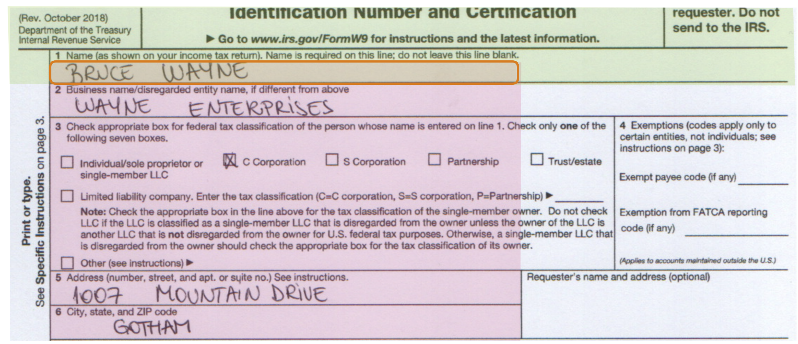

# EasyDoc

```Python
from EasyDoc import EasyDoc
doc = EasyDoc(r"Test.pdf")

ocr_result = doc.get_ocr_result()
doc.on_the_same_column(text='Name (as shown', relation='below')
doc.set_region(text='Business name', relation='above')
doc.extract_ocr(engine='TrOCR-handwritten')
doc.draw_region('Name', show_image=True)
```



# Installation
Prepare env: Python 3.9, PyTorch 1.12.1, CUDA 11.6, Cudnn 8.4

```commandline
pip install pandas sentence-transformers pdf2image easyocr

pip install paddlepaddle-gpu==2.4.1.post116 -f https://www.paddlepaddle.org.cn/whl/windows/mkl/avx/stable.html

pip uninstall opencv-python opencv-python-headless

pip install "paddleocr>=2.0.1"
```

# Usage
## Initialization
```Python
doc = EasyDoc(r"Test.pdf")
ocr_result = doc.get_ocr_result()
```
| Paremeter    | Default value      |
|--------------|--------------------|
| lang         | en, ch, cht        |
| page         | 1                  |
| temp_folder  | tmp                |
| tmp_prefix   | image              |
| poppler_path | poppler-0.68.0\bin |

## find_text
```Python
element = doc.find_text(keyword='Name',fuzzy=0.65, position='top').iloc[0][:]
```
position: ['top','bottom','above','below']

## set_region
```Python
element = doc.find_text(keyword='Name',fuzzy=0.65, position='top').iloc[0][:]
doc.set_region(element, relation='above', offset=-30)
#or directly search by text
doc.set_region(text='Employer Identification number', relation='above', offset=-30)
```
| relation | position | default | Note                                          |
|----------|----------|---------|-----------------------------------------------|
| above    | whole    | Yes     | Above the entire element                      |
| above    | bottom   |         | Above the bottom of the element               |
| below    | whole    | Yes     | Below the entire element                      |
| below    | top      |         | Below the top of the element                  |
| left     | whole    | Yes     | On the left of the entire element             |
| left     | right    |         | On the left of the right-edge of the element  |              
| right    | whole    | Yes     | On the right of the entire element            |
| right    | left     |         | On the right of the left-edge of the element  |


## reset_region
We should reset the region when working on a new extraction area
```Python
doc.reset_region()
```

## on_the_same_row
Search by element
```Python
element = doc.find_text(keyword='Name (as shown',fuzzy=0.65, position='top').iloc[0][:]
doc.on_the_same_column(element, relation='below')
```
Search by text
```
doc.on_the_same_column(text='Name (as shown', relation='below')
```

Optional: 
- offset = (a,b)
- relation = 'above' or 'below'


## on_the_same_column
Search by element
```Python
element = doc.find_text(keyword='Social security number',fuzzy=0.65, position='top').iloc[0][:]
doc.on_the_same_column(element, relation='below', offset=(0, 420))
```
Search by text
```
doc.on_the_same_column(text='Social security number', relation='below', offset=(0, 420))
```

Optional: 
- offset = (a,b)
- relation = 'above' or 'below'


## extract_ocr
Available OCR engines:
- PaddleOCR
- EasyOCR
- TrOCR-handwritten (English only)

## draw_region
Draw the region for debug purpose:
```Python
doc.draw_region(label='Name', show_image=True)
```

## Troubleshoot

### partially initialized module 'cv2' has no attribute 'gapi_wip_gst_GStreamerPipeline'
```commandline
pip uninstall opencv-python opencv-python-headless
pip install "paddleocr>=2.0.1"
```

### Could not load library cudnn_cnn_infer64_8.dll. Error code 193
- Locate `zlib.dll` from `C:\Program Files\NVIDIA Corporation`
- Copy the `zlibe.dll` to the correspondent CUDA folder: `C:\Program Files\NVIDIA GPU Computing Toolkit\CUDA\v11.6\bin`, and rename it as `zlibwapi.dll`